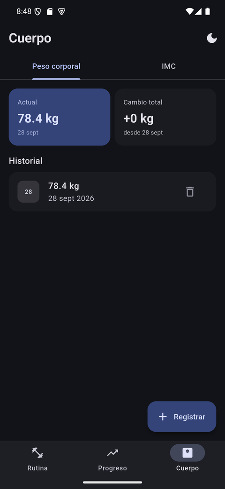
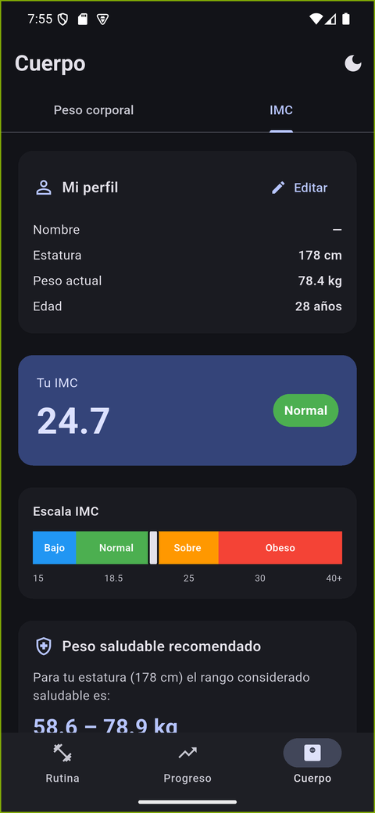
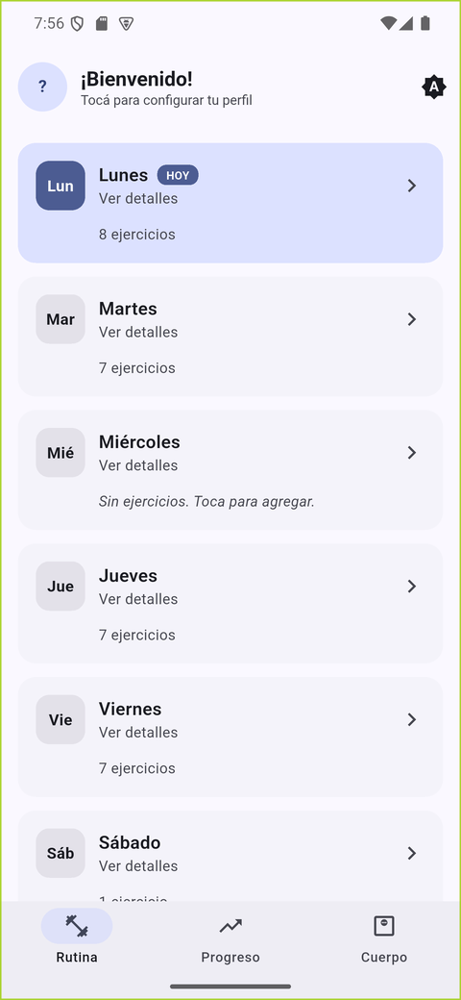

# Lift.xto
 
App Flutter para llevar el seguimiento de tu rutina de gimnasio con **sobrecarga progresiva**, **peso corporal** e **IMC**. Toda la información se guarda **localmente con SQLite** vía `sqflite`.
 
## Características
 
- ✅ Rutina semanal precargada (Lunes a Sábado) con tu plan actual
- ✅ Editar / eliminar / agregar ejercicios en cualquier día (incluido Miércoles)
- ✅ Registro de peso (kg) × sets × reps por sesión
- ✅ Registro de duración (segundos) para planchas y cardio
- ✅ Gráfico de evolución por ejercicio con `fl_chart`
- ✅ Récord personal (PR) y resumen de sesiones
- ✅ Tracking de peso corporal con gráfico
- ✅ Calculadora de IMC con peso saludable recomendado
- ✅ Almacenamiento 100% local con SQLite
- ✅ Material 3 con paleta **azul marino** (seed `#1E3A8A`)
- ✅ Toggle **claro / oscuro / sistema** persistente con `SharedPreferences`
- ✅ Arquitectura en capas (Repository + Observer) con inyección de dependencias vía `provider`
- ✅ Validación de rangos centralizada y feedback visible de errores
- ✅ Backups de Android deshabilitados y build de release minificado/ofuscado
- ✅ Sincronización opcional offline-first con Firebase (Google Sign-In + Firestore), patrón outbox

## Capturas de pantalla

| Rutina semanal | Ejercicios del día | Progresión + PR |
|---|---|---|
|  |  |  |

| Récords personales | Peso corporal | IMC |
|---|---|---|
|  |  |  |

| Tema claro |
|---|
|  |

## Arquitectura

La app sigue una arquitectura en capas simple, pensada para una app local-first
(sin backend) pero con los mismos problemas de cualquier app con estado
compartido entre pantallas:

```
UI (screens/widgets)
   │  context.read<XRepository>()  →  llama a métodos, valida con Validators
   │  repo.addListener(_load)      →  se re-suscribe a cambios (Observer)
   ▼
Repositories (ChangeNotifier)       — capa de dominio
   │  try/catch → relanza como AppException con mensaje user-friendly
   ▼
DatabaseHelper (singleton)          — capa de datos, SQL parametrizado
   ▼
SQLite (sqflite)
```

- **Repository** (`lib/repositories/`): un repositorio por dominio
  (`ExerciseRepository`, `ExerciseLogRepository`, `BodyWeightRepository`,
  `ProfileRepository`). Envuelven a `DatabaseHelper` — que se mantiene igual,
  ya que su SQL ya usaba `where`/`whereArgs` parametrizados — y son el único
  punto de contacto entre la UI y los datos.
- **Observer** (`ChangeNotifier`): cada repositorio notifica a sus listeners
  después de cada escritura exitosa. Las pantallas se suscriben en
  `initState` (`repo.addListener(_load)`) y se desuscriben en `dispose`. Esto
  resuelve un bug real que tenía la versión anterior: como `HomeScreen` usa
  `IndexedStack` para las 3 tabs, si registrabas un peso en la tab Rutina, la
  tab Progreso quedaba con datos viejos hasta reiniciar la app. Ahora se
  actualiza sola, sin importar en qué tab estés.
- **Inyección de dependencias** vía [`provider`](https://pub.dev/packages/provider):
  los 4 repositorios se crean una sola vez en `main.dart` dentro de un
  `MultiProvider` y bajan por el árbol de widgets con `context.read<T>()`.
  Facilita testear cada capa por separado (podés inyectar un repositorio
  fake sin tocar SQLite).
- **Validación centralizada** (`lib/utils/validators.dart`): rangos con
  sentido físico (peso, estatura, edad, sets, reps, duración) reutilizados
  por todos los formularios — antes cada uno tenía su propia validación
  ad-hoc e inconsistente.
- **Manejo de errores**: los repositorios atrapan excepciones de la
  plataforma (SQLite, IO) y las relanzan como `AppException`
  (`lib/core/app_exception.dart`) con un mensaje apto para mostrar directo al
  usuario vía `showErrorSnackBar` (`lib/utils/feedback.dart`) — antes, si una
  escritura fallaba, no pasaba nada visible.

## Estructura
 
```
lib/
├── main.dart                       # Entry point + MultiProvider + tema
├── core/
│   └── app_exception.dart          # Excepción de dominio con mensaje user-friendly
├── database/
│   ├── database_helper.dart        # SQLite singleton + CRUD + queries agregadas
│   └── default_routine.dart        # Seed de tu rutina
├── repositories/
│   ├── exercise_repository.dart       # CRUD ejercicios (ChangeNotifier)
│   ├── exercise_log_repository.dart   # CRUD logs + PR + resumen de progreso
│   ├── body_weight_repository.dart    # CRUD peso corporal
│   └── profile_repository.dart        # Perfil de usuario
├── sync/
│   ├── auth_repository.dart        # Google Sign-In (firebase_auth), degrada sin Firebase
│   └── sync_service.dart           # Push/pull outbox contra Firestore
├── models/
│   ├── exercise.dart
│   ├── exercise_log.dart
│   ├── body_weight_log.dart
│   └── user_profile.dart
├── screens/
│   ├── home_screen.dart            # Bottom navigation
│   ├── routine_screen.dart         # Vista de los 7 días
│   ├── day_exercises_screen.dart   # Ejercicios de un día
│   ├── add_edit_exercise_screen.dart
│   ├── exercise_detail_screen.dart # Historial + gráfico + PR
│   ├── progress_screen.dart        # Resumen de PRs + mapa muscular
│   ├── muscle_map_tab.dart         # Mapa muscular por volumen
│   └── body_screen.dart            # Tabs: Peso corporal | IMC
├── widgets/
│   ├── log_entry_sheet.dart        # Bottom sheet para registrar peso
│   ├── body_weight_sheet.dart      # Bottom sheet para peso corporal
│   ├── profile_sheet.dart          # Bottom sheet del perfil
│   ├── account_sheet.dart          # Bottom sheet de cuenta/sincronización
│   ├── sync_status_button.dart     # Ícono ☁️ de estado de sync en el AppBar
│   ├── state_views.dart            # LoadingView + EmptyStateView reutilizables
│   └── theme_toggle_button.dart    # Botón AppBar para alternar tema
└── utils/
    ├── constants.dart              # Días de la semana, tracking types
    ├── validators.dart             # Validadores centralizados con rangos
    ├── feedback.dart               # showErrorSnackBar(context, error)
    ├── theme.dart                  # Material 3 theme (seed azul marino)
    └── theme_controller.dart       # ValueNotifier + persistencia del modo
```
 
## Setup
 
```bash
flutter create lift_xto
cd lift_xto
# Reemplazá pubspec.yaml y la carpeta lib/ con los archivos de este proyecto
flutter pub get
flutter run
```
 
### Nombre visible en el launcher
 
El `pubspec.yaml` define el package interno (`lift_xto`), pero el nombre que ve el usuario en el ícono de la app se configura aparte:
 
**Android** — `android/app/src/main/AndroidManifest.xml`:
```xml
<application android:label="Lift.xto" ...>
```
 
**iOS** — `ios/Runner/Info.plist`:
```xml
<key>CFBundleDisplayName</key>
<string>Lift.xto</string>
```
 
## Esquema SQLite
 
```sql
exercises (id, day_of_week, name, sets, reps_min, reps_max,
           duration_seconds_min, duration_seconds_max,
           tracking_type, order_index, notes)
 
exercise_logs (id, exercise_id, date, weight_kg, sets_completed,
               reps_completed, duration_seconds, notes)
 
body_weight_logs (id, date, weight_kg, notes)
 
user_profile (id, height_cm, age, gender)
```
 
Las foreign keys están activas (`PRAGMA foreign_keys = ON`), así que eliminar un ejercicio borra en cascada todo su historial. El archivo de la BD se llama `lift_xto.db`.

## Sincronización (Firebase, opcional)

SQLite sigue siendo la **única fuente de verdad**: la app funciona 100%
igual sin conexión, y toda lectura de la UI pasa siempre por los
repositorios locales. La sincronización con Firestore es un agregado
opcional detrás de Google Sign-In, con patrón **outbox**:

```
Escritura local (repo.add/update/delete)
   │  DatabaseHelper marca sync_status='pending' + updated_at=ahora
   ▼
SyncService.requestSync()  (fire-and-forget, no bloquea la UI)
   │  si hay sesión + conexión →
   ├─ push: sube filas 'pending' a users/{uid}/{colección}/{sync_id}
   ├─ push: propaga tombstones (borrados) como {deleted:true}
   └─ pull: trae docs con updatedAt > lastSyncedAt, upsert local
            por sync_id con last-write-wins
```

- **`sync_id`** (UUID v4 generado en el cliente) identifica cada fila entre
  dispositivos — el `id INTEGER AUTOINCREMENT` local sigue existiendo sólo
  para las foreign keys de SQLite, nunca sale del dispositivo.
- **`sync_status`** (`pending` | `synced`) es lo que le da nombre al patrón
  outbox: cada escritura queda "pendiente de envío" hasta confirmarse.
- **Borrados**: en vez de un `DELETE` directo, se guarda un *tombstone*
  (`sync_tombstones`) que al pushearse marca el documento remoto como
  `{deleted: true}` — así otro dispositivo que haga `pull` se entera del
  borrado y también lo aplica localmente.
- **Conflictos**: *last-write-wins* comparando `updated_at`
  (`remoteWinsConflict()` en `lib/sync/sync_service.dart`, testeada en
  `test/sync/sync_service_test.dart`) — sin merge de campos, gana el cambio
  más reciente. Suficiente para un tracker personal con baja probabilidad de
  edición simultánea real.
- **Disparadores**: al iniciar sesión, al recuperar conexión
  (`connectivity_plus`), después de cada escritura local, o manualmente
  desde el botón ☁️ del AppBar → "Sincronizar ahora".
- **Sin Firebase configurado**: `Firebase.initializeApp()` está envuelto en
  `try/catch` en `main.dart` — si falla (por ejemplo, con el
  `google-services.json` de ejemplo), la app sigue funcionando 100% local y
  el botón de cuenta muestra "Sincronización no configurada" en vez de
  crashear.

### Configurar tu propio Firebase

1. Crear un proyecto en [Firebase Console](https://console.firebase.google.com).
2. Agregar una app Android con `applicationId` = `com.example.lift_xto`.
3. Sacar el SHA-1 de tu keystore de debug (`cd android && ./gradlew signingReport`) y cargarlo en la app Android de Firebase — si no, Google Sign-In falla con `DEVELOPER_ERROR`.
4. Habilitar **Authentication → Sign-in method → Google**.
5. Habilitar **Firestore Database** y pegar las reglas de [`firestore.rules`](firestore.rules) en la consola.
6. Descargar `google-services.json` y ponerlo en `android/app/` (está en `.gitignore`; hay un `google-services.json.example` como referencia de formato).

## Seguridad

La app no requiere conexión para funcionar (no pide el permiso `INTERNET`
por sí misma — Firebase lo agrega sólo si configurás sincronización), y
como guarda datos de salud (peso, estatura, edad) localmente, vale
endurecerla igual:

- **SQL parametrizado**: todas las queries de `DatabaseHelper` usan
  `where`/`whereArgs` (o placeholders `?` en los `rawQuery`), nunca
  interpolación de strings — cero superficie de SQL injection, aunque la
  fuente sea 100% local.
- **Reglas de Firestore por usuario** (`firestore.rules`): cada documento
  vive bajo `users/{uid}/...` y sólo es legible/escribible por ese mismo
  `uid` autenticado (`request.auth.uid == uid`) — un usuario nunca puede ver
  ni tocar los datos de otro, aunque conociera su `uid`.
- **Validación de rangos** (`lib/utils/validators.dart`): antes se podía
  guardar un peso de 999999 kg o una edad de 500 años (sólo se chequeaba
  `n >= 0`). Ahora cada campo tiene un rango físicamente razonable (peso
  20–500 kg según contexto, estatura 50–250 cm, edad 1–120, etc.) y las notas
  tienen un límite de 200 caracteres.
- **Backups deshabilitados**: `android:allowBackup="false"` en el
  `AndroidManifest.xml` evita que Android incluya la base de datos local en
  backups automáticos a la nube o vía `adb backup`.
- **Release minificado y ofuscado**: `android/app/build.gradle.kts` habilita
  `isMinifyEnabled` + `isShrinkResources` con reglas de ProGuard
  (`android/app/proguard-rules.pro`), reduciendo tamaño de APK y dificultando
  ingeniería inversa del bytecode Kotlin/Java.
- **Firma de release**: por ahora sigue usando la keystore de debug como
  placeholder (`flutter run --release` funciona out-of-the-box). Para
  publicar de verdad, generá tu propia keystore y configurá
  `signingConfigs.release` en `android/app/build.gradle.kts` — es una acción
  que sólo vos podés hacer con tu propio material secreto.

## Cómo funciona la sobrecarga progresiva
 
1. Tocá un día de la semana → tocá un ejercicio.
2. Pulsá **"Registrar"** y guardá peso × sets × reps de esa sesión.
3. La próxima vez, el formulario auto-rellena los valores anteriores como referencia.
4. La gráfica muestra la evolución y el card de **PR** marca tu récord absoluto.
## Cómo funciona el IMC
 
1. Pestaña **Cuerpo → IMC → Editar perfil** → ingresá estatura.
2. Registrá tu peso en la pestaña **Peso corporal**.
3. La pantalla calcula:
   - Tu IMC actual
   - Categoría (Bajo peso / Normal / Sobrepeso / Obesidad)
   - Rango de peso saludable para tu estatura (BMI 18.5–24.9)
## Tema claro / oscuro
 
El icono en la AppBar (esquina superior derecha en cualquier tab) cicla entre tres estados:
 
| Icono | Modo | Comportamiento |
|---|---|---|
| 🌗 `brightness_auto` | Sistema | Sigue al ajuste del SO |
| ☀️ `light_mode` | Claro | Forzado |
| 🌙 `dark_mode` | Oscuro | Forzado |
 
La preferencia se persiste en `SharedPreferences` (key `theme_mode`) y se aplica antes del primer frame para evitar parpadeos al iniciar.
 
## Notas técnicas
 
- Repositorios (`ChangeNotifier`) + `provider` para el estado de datos; un
  `ValueNotifier` global (`ThemeController`) sólo para el tema, que es estado
  de UI puro y no necesita pasar por un repositorio.
- `IndexedStack` mantiene el estado de cada tab del bottom navigation; ya no
  es un problema que queden "de fondo" porque escuchan a los repositorios.
- `AutomaticKeepAliveClientMixin` en las sub-tabs de Cuerpo para no recargar al hacer swipe.
- Migrations preparadas: cuando incrementes `_dbVersion`, agregá la lógica en `onUpgrade`.
- Locale `es` inicializado en `main.dart` para `DateFormat`.

## Tests

```bash
flutter test
```

- `test/models/`: serialización de los modelos (`toMap`/`fromMap`).
- `test/utils/validators_test.dart`: casos límite de cada validador.
- `test/utils/constants_test.dart`: helpers de días de la semana.
- `test/database/database_helper_migration_test.dart`: la migración v2→v3
  (columnas de sync) no pierde datos y backfillea correctamente, usando
  `sqflite_common_ffi` (SQLite de escritorio, sin depender de un
  dispositivo/emulador).
- `test/sync/sync_service_test.dart`: resolución de conflictos
  *last-write-wins* (`remoteWinsConflict`), sin tocar Firestore.
- `test/widget_test.dart`: smoke test — la app monta sin excepciones, con
  Firebase deshabilitado (como un clon fresco sin `google-services.json`
  real).