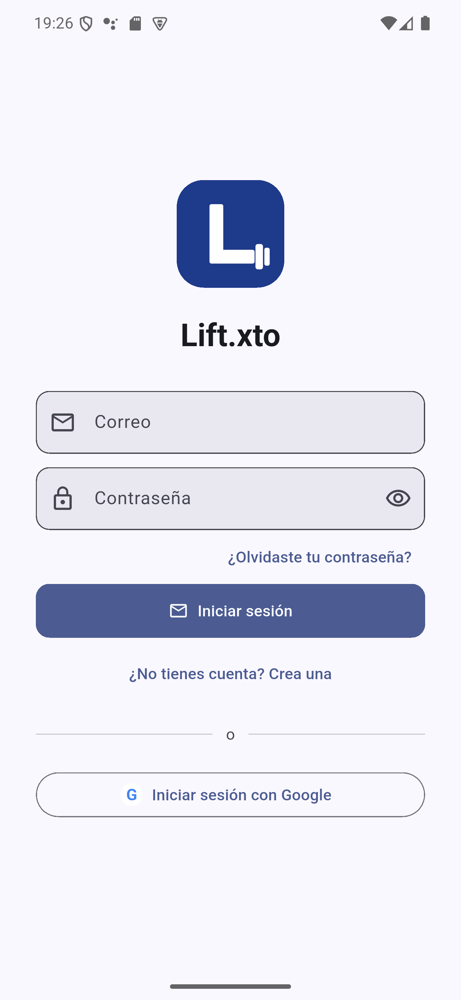
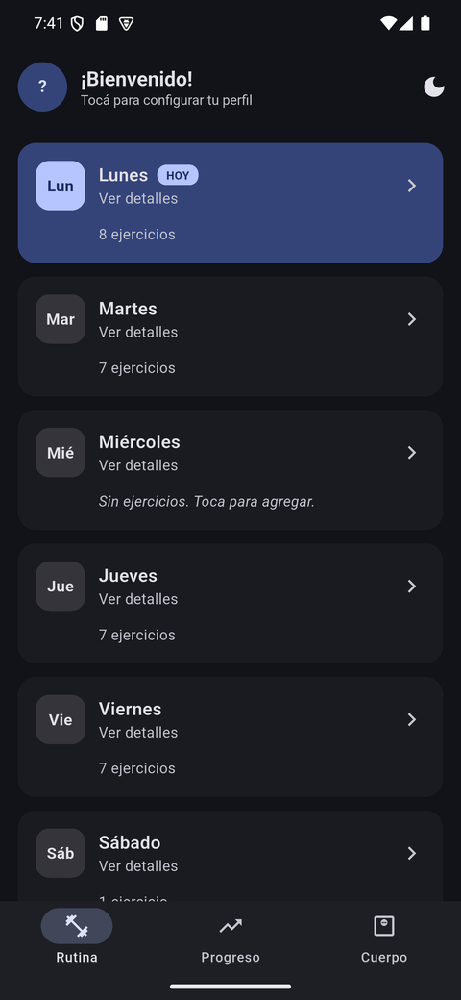
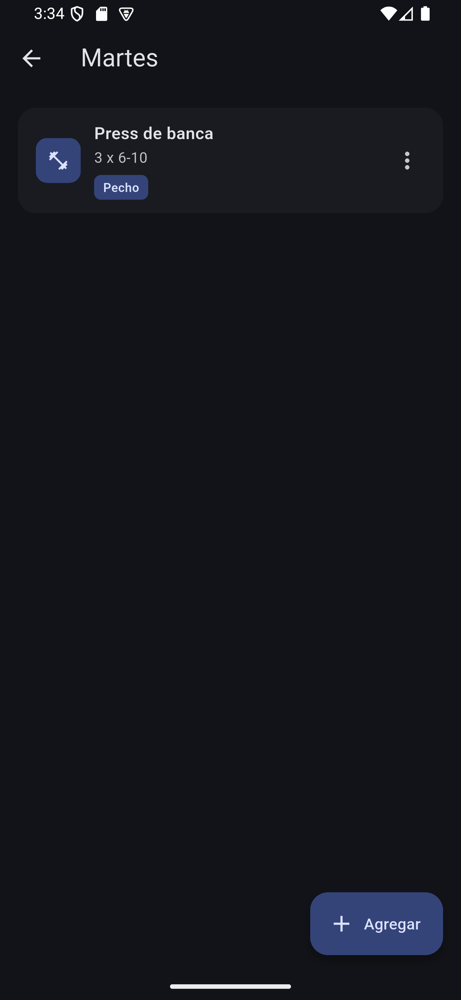
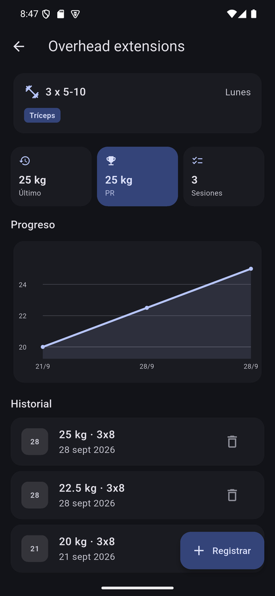
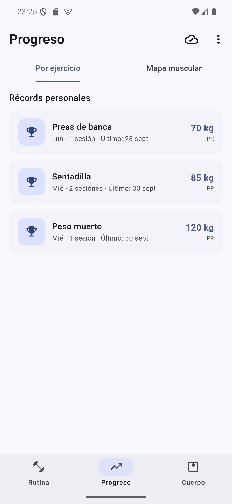
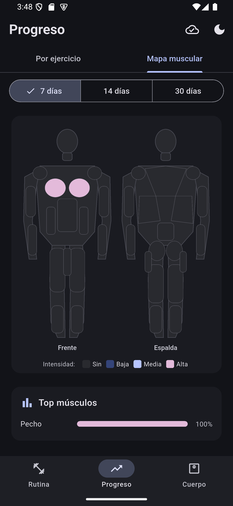
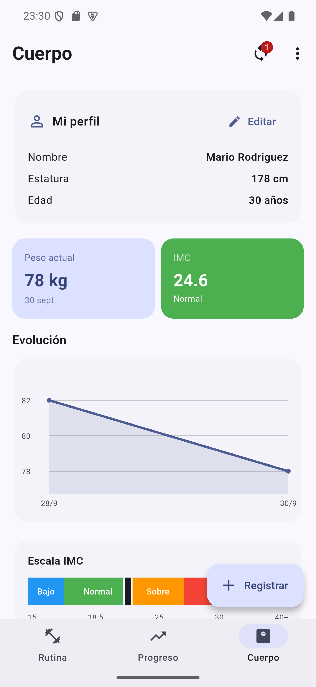

# Lift.xto
 
App Flutter para llevar el seguimiento de tu rutina de gimnasio con **sobrecarga progresiva**, **peso corporal** e **IMC**. Toda la información se guarda **localmente con SQLite** vía `sqflite`.
 
## Características
 
- ✅ Rutina semanal vacía por defecto (Lunes a Sábado) — cada usuario arma la suya desde cero
- ✅ Editar / eliminar / agregar ejercicios en cualquier día (incluido Miércoles)
- ✅ Categorización muscular manual: al crear un ejercicio eliges su grupo muscular (18 grupos específicos) desde un combo, en vez de depender de detectarlo por el nombre
- ✅ Catálogo de referencia de ~1300 ejercicios (buscar, filtrar por músculo, ver instrucciones paso a paso en español y GIF de la técnica) para precargar nombre + músculo al crear un ejercicio — ver [Catálogo de ejercicios](#catálogo-de-ejercicios)
- ✅ Mapa muscular visual que refleja el volumen trabajado por grupo, usando esa categorización
- ✅ Registro de peso (kg) × sets × reps por sesión
- ✅ Registro de duración (segundos) para planchas y cardio
- ✅ Gráfico de evolución por ejercicio con `fl_chart`
- ✅ Récord personal (PR) y resumen de sesiones
- ✅ Pantalla de Cuerpo unificada: peso actual, IMC, escala visual y rango saludable juntos en una sola vista (antes eran 2 tabs separadas)
- ✅ Medidas corporales (cintura, pecho, cadera, bíceps, muslo, pantorrilla, cuello) con gráfico de evolución por zona — complementa el peso/IMC con composición corporal aproximada
- ✅ Racha de constancia: días consecutivos entrenados según lo programado en la rutina (los días libres no la cortan), visible en la pantalla de Rutina
- ✅ Configuración de perfil (nombre, apellido, estatura y fecha de nacimiento) obligatoria la primera vez que se inicia sesión, antes de dejar entrar al resto de la app — la edad se calcula sola a partir de la fecha
- ✅ Almacenamiento 100% local con SQLite
- ✅ Material 3 con paleta **azul marino** (seed `#1E3A8A`)
- ✅ Modo **claro por defecto**, con toggle claro / oscuro / sistema (desde el menú ⋮) persistente vía `SharedPreferences`
- ✅ Arquitectura en capas (Repository + Observer) con inyección de dependencias vía `provider`
- ✅ Validación de rangos centralizada y feedback visible de errores
- ✅ Backups de Android deshabilitados y build de release minificado/ofuscado
- ✅ Login obligatorio con Google **o email/contraseña** + sincronización offline-first con Firebase (Firestore), patrón outbox
- ✅ Multi-dispositivo: iniciar sesión en un dispositivo nuevo trae automáticamente toda tu data (rutina, progreso, peso, perfil)

## Capturas de pantalla

| Login | Rutina semanal | Ejercicios del día |
|---|---|---|
|  |  |  |

| Detalle + PR | Récords personales | Mapa muscular |
|---|---|---|
|  |  |  |

| Cuerpo (perfil + peso + IMC) |
|---|
|  |

## Arquitectura

La app sigue una arquitectura en capas simple, local-first: SQLite es la
única fuente de verdad para la UI (Firestore es un respaldo/sincronización
en segundo plano, nunca se lee directo desde una pantalla), con los mismos
problemas de cualquier app con estado compartido entre pantallas:

```
UI (screens/widgets)
   │  context.read<XRepository>()  →  llama a métodos, valida con Validators
   │  repo.addListener(_load)      →  se re-suscribe a cambios (Observer)
   ▼
Repositories (ChangeNotifier)       — capa de dominio
   │  try/catch → relanza como AppException con mensaje user-friendly
   ▼
DatabaseHelper (singleton)          — capa de datos, SQL parametrizado
   ▼
SQLite (sqflite)
```

- **Repository** (`lib/repositories/`): un repositorio por dominio
  (`ExerciseRepository`, `ExerciseLogRepository`, `BodyWeightRepository`,
  `ProfileRepository`). Envuelven a `DatabaseHelper` — que se mantiene igual,
  ya que su SQL ya usaba `where`/`whereArgs` parametrizados — y son el único
  punto de contacto entre la UI y los datos.
- **Observer** (`ChangeNotifier`): cada repositorio notifica a sus listeners
  después de cada escritura exitosa. Las pantallas se suscriben en
  `initState` (`repo.addListener(_load)`) y se desuscriben en `dispose`. Esto
  resuelve un bug real que tenía la versión anterior: como `HomeScreen` usa
  `IndexedStack` para las 3 tabs, si registrabas un peso en la tab Rutina, la
  tab Progreso quedaba con datos viejos hasta reiniciar la app. Ahora se
  actualiza sola, sin importar en qué tab estés.
- **Inyección de dependencias** vía [`provider`](https://pub.dev/packages/provider):
  los 4 repositorios se crean una sola vez en `main.dart` dentro de un
  `MultiProvider` y bajan por el árbol de widgets con `context.read<T>()`.
  Facilita testear cada capa por separado (se puede inyectar un repositorio
  fake sin tocar SQLite).
- **Validación centralizada** (`lib/utils/validators.dart`): rangos con
  sentido físico (peso, estatura, sets, reps, duración) reutilizados por
  todos los formularios — antes cada uno tenía su propia validación ad-hoc
  e inconsistente.
- **Manejo de errores**: los repositorios atrapan excepciones de la
  plataforma (SQLite, IO) y las relanzan como `AppException`
  (`lib/core/app_exception.dart`) con un mensaje apto para mostrar directo al
  usuario vía `showErrorSnackBar` (`lib/utils/feedback.dart`) — antes, si una
  escritura fallaba, no pasaba nada visible.

## Estructura
 
```
lib/
├── main.dart                       # Entry point + MultiProvider + AuthGate + tema
├── core/
│   └── app_exception.dart          # Excepción de dominio con mensaje user-friendly
├── database/
│   └── database_helper.dart        # SQLite singleton + CRUD + queries agregadas
├── repositories/
│   ├── exercise_repository.dart       # CRUD ejercicios (ChangeNotifier)
│   ├── exercise_log_repository.dart   # CRUD logs + PR + resumen de progreso
│   ├── body_weight_repository.dart    # CRUD peso corporal
│   ├── body_measurement_repository.dart # CRUD medidas corporales
│   ├── profile_repository.dart        # Perfil de usuario
│   └── exercise_catalog_repository.dart # Catálogo de referencia (asset estático, sólo lectura)
├── sync/
│   ├── auth_repository.dart        # Google Sign-In + email/contraseña (firebase_auth), degrada sin Firebase
│   └── sync_service.dart           # Push/pull outbox contra Firestore
├── models/
│   ├── exercise.dart
│   ├── exercise_log.dart
│   ├── body_weight_log.dart
│   ├── body_measurement.dart       # Medidas corporales (7 zonas opcionales)
│   ├── user_profile.dart
│   └── catalog_exercise.dart       # Ejercicio del catálogo de referencia
├── screens/
│   ├── login_screen.dart           # Puerta de acceso obligatoria (Google o email/contraseña)
│   ├── profile_setup_screen.dart   # Configuración de perfil obligatoria (primer inicio)
│   ├── home_screen.dart            # Bottom navigation
│   ├── routine_screen.dart         # Vista de los 7 días
│   ├── day_exercises_screen.dart   # Ejercicios de un día
│   ├── add_edit_exercise_screen.dart
│   ├── exercise_catalog_screen.dart # Buscar/filtrar en el catálogo de referencia
│   ├── exercise_detail_screen.dart # Historial + gráfico + PR
│   ├── progress_screen.dart        # Resumen de PRs + mapa muscular
│   ├── muscle_map_tab.dart         # Mapa muscular por volumen y grupo elegido a mano
│   └── body_screen.dart            # Cuerpo: perfil + peso + IMC en una sola vista
├── widgets/
│   ├── log_entry_sheet.dart        # Bottom sheet para registrar peso
│   ├── body_weight_sheet.dart      # Bottom sheet para peso corporal
│   ├── body_measurement_sheet.dart # Bottom sheet para medidas corporales
│   ├── profile_sheet.dart          # Bottom sheet del perfil
│   ├── sync_status_button.dart     # Ícono ☁️ de estado de sync en el AppBar (toca = sincronizar/confirmar)
│   ├── app_menu_button.dart        # Menú ⋮: cambiar tema + cerrar sesión
│   ├── google_logo.dart            # Ícono "G" para el botón de Google Sign-In
│   ├── catalog_exercise_media.dart # Miniatura/GIF del catálogo vía Firebase Storage (con fallback)
│   └── state_views.dart            # LoadingView + EmptyStateView reutilizables
└── utils/
    ├── constants.dart              # Días de la semana, tracking types
    ├── validators.dart             # Validadores centralizados con rangos
    ├── feedback.dart               # showErrorSnackBar(context, error)
    ├── theme.dart                  # Material 3 theme (seed azul marino)
    ├── theme_controller.dart       # ValueNotifier + persistencia del modo
    └── streak.dart                 # computeStreak() — racha de constancia (función pura)
```
 
## Setup
 
```bash
flutter create lift_xto
cd lift_xto
# Reemplaza pubspec.yaml y la carpeta lib/ con los archivos de este proyecto
flutter pub get
flutter run
```
 
### Nombre visible en el launcher
 
El `pubspec.yaml` define el package interno (`lift_xto`), pero el nombre que ve el usuario en el ícono de la app se configura aparte:
 
**Android** — `android/app/src/main/AndroidManifest.xml`:
```xml
<application android:label="Lift.xto" ...>
```
 
**iOS** — `ios/Runner/Info.plist`:
```xml
<key>CFBundleDisplayName</key>
<string>Lift.xto</string>
```
 
## Esquema SQLite
 
```sql
exercises (id, day_of_week, name, sets, reps_min, reps_max,
           duration_seconds_min, duration_seconds_max,
           tracking_type, order_index, notes, muscle_group)
 
exercise_logs (id, exercise_id, date, weight_kg, sets_completed,
               reps_completed, duration_seconds, notes)
 
body_weight_logs (id, date, weight_kg, notes)
 
body_measurements (id, date, waist_cm, chest_cm, hip_cm, bicep_cm,
                    thigh_cm, calf_cm, neck_cm, notes)
 
user_profile (id, first_name, last_name, height_cm, birth_date, gender)
```
 
Las foreign keys están activas (`PRAGMA foreign_keys = ON`), así que eliminar un ejercicio borra en cascada todo su historial. El archivo de la BD se llama `lift_xto.db`.

## Sincronización (Firebase)

El login es **obligatorio** (con Google o con email/contraseña):
`AuthGate` (`lib/main.dart`) muestra `LoginScreen` hasta que hay sesión, y
recién ahí deja pasar a `HomeScreen` — ver `lib/screens/login_screen.dart`.
Iniciar sesión en un dispositivo nuevo con la misma cuenta trae
automáticamente toda la data existente (rutina, progreso, peso, perfil) vía
el `pull` inicial descrito abajo. Una vez logueado, todo funciona
offline con normalidad (sólo el login inicial necesita conexión); SQLite
sigue siendo la **única fuente de verdad** para la UI, y toda lectura de
pantalla pasa siempre por los repositorios locales. La sincronización con
Firestore corre en segundo plano con patrón **outbox**:

```
Escritura local (repo.add/update/delete)
   │  DatabaseHelper marca sync_status='pending' + updated_at=ahora
   ▼
SyncService.requestSync()  (fire-and-forget, no bloquea la UI)
   │  si hay sesión + conexión →
   ├─ push: sube filas 'pending' a users/{uid}/{colección}/{sync_id}
   ├─ push: propaga tombstones (borrados) como {deleted:true}
   └─ pull: trae docs con updatedAt > lastSyncedAt, upsert local
            por sync_id con last-write-wins
```

- **`sync_id`** (UUID v4 generado en el cliente) identifica cada fila entre
  dispositivos — el `id INTEGER AUTOINCREMENT` local sigue existiendo sólo
  para las foreign keys de SQLite, nunca sale del dispositivo.
- **`sync_status`** (`pending` | `synced`) es lo que le da nombre al patrón
  outbox: cada escritura queda "pendiente de envío" hasta confirmarse.
- **Borrados**: en vez de un `DELETE` directo, se guarda un *tombstone*
  (`sync_tombstones`) que al pushearse marca el documento remoto como
  `{deleted: true}` — así otro dispositivo que haga `pull` se entera del
  borrado y también lo aplica localmente.
- **Conflictos**: *last-write-wins* comparando `updated_at`
  (`remoteWinsConflict()` en `lib/sync/sync_service.dart`, testeada en
  `test/sync/sync_service_test.dart`) — sin merge de campos, gana el cambio
  más reciente. Suficiente para un tracker personal con baja probabilidad de
  edición simultánea real.
- **Disparadores**: al iniciar sesión (dispara la primera sincronización
  completa, "todo se carga desde ahí"), al recuperar conexión
  (`connectivity_plus`), después de cada escritura local, o manualmente
  desde el botón ☁️ del AppBar → "Sincronizar ahora".
- **La UI se refresca sola con datos que llegan por `pull`**: un `pull`
  remoto escribe directo en `DatabaseHelper` (no pasa por los
  repositorios), así que cada repositorio se suscribe también a
  `SyncService` (`_sync?.addListener(notifyListeners)`) y reenvía ese aviso
  como propio — las pantallas, que ya escuchaban al repositorio, se
  recargan solas sin código extra.
- **Sin Firebase configurado**: `Firebase.initializeApp()` está envuelto en
  `try/catch` en `main.dart` — si falla (por ejemplo, con el
  `google-services.json` de ejemplo), la app no crashea, pero como el login
  es obligatorio, `LoginScreen` queda mostrando "Sincronización no
  configurada" en vez de un botón de login roto (no hay forma de entrar a
  la app en ese estado).

### Configurar tu propio Firebase

1. Crear un proyecto en [Firebase Console](https://console.firebase.google.com).
2. Agregar una app Android con `applicationId` = `io.liftxto.app` (o el que hayas elegido — tiene que coincidir exacto con `android/app/build.gradle.kts`).
3. Sacar el SHA-1 de tu keystore de debug (`cd android && ./gradlew signingReport`) y cargarlo en la app Android de Firebase — si no, Google Sign-In falla con `DEVELOPER_ERROR`.
4. Habilitar **Authentication → Sign-in method → Google** y, si querés ofrecer también login por email/contraseña, **Email/Password**.
5. Habilitar **Firestore Database** y pegar las reglas de [`firestore.rules`](firestore.rules) en la consola.
6. Descargar `google-services.json` y ponerlo en `android/app/` (está en `.gitignore`; hay un `google-services.json.example` como referencia de formato).
7. (Opcional) Si querés las imágenes/GIFs del catálogo de ejercicios, habilitar **Storage** y pegar las reglas de [`storage.rules`](storage.rules) en la consola — ver [Catálogo de ejercicios](#catálogo-de-ejercicios).

## Catálogo de ejercicios

Al crear un ejercicio (`AddEditExerciseScreen`), el botón "Elegir del
catálogo" abre `ExerciseCatalogScreen`: buscar por nombre, filtrar por
músculo, y elegir uno precarga el nombre + grupo muscular en el formulario.
El catálogo viene del dataset
[hasaneyldrm/exercises-dataset](https://github.com/hasaneyldrm/exercises-dataset)
(~1300 ejercicios, licencia MIT para el texto).

El dataset sólo trae el nombre en inglés (las instrucciones sí vienen en
español) — `build_exercise_catalog.py` genera además `nameEs`, una
traducción automática por diccionario de vocabulario de gimnasio (equipo,
movimiento, posición, músculo; ver `PHRASES_ES`/`WORDS_ES` en ese script).
No es una traducción profesional — palabras fuera del diccionario quedan
en inglés en vez de perderse — pero cubre bien la mayoría del catálogo.
`nameEs` es el nombre que se muestra como principal (el original en inglés
queda como referencia más chico debajo) y la búsqueda matchea por palabra
suelta contra ambos, en cualquier orden.

Está dividido en dos partes con licencias distintas:

- **Texto (nombre, categoría, equipo, instrucciones en español, músculo)**:
  MIT, ya está bundleado en `assets/data/exercise_catalog.json`
  (generado por `scripts/build_exercise_catalog.py`, que mapea el
  `target` del dataset a los 18 grupos de
  `lib/utils/muscle_groups.dart`). Funciona siempre, sin Firebase.
- **Media (miniaturas + GIFs de la técnica)**: © [Gym visual](https://gymvisual.com/),
  redistribuida en el dataset original bajo permiso específico para ESE
  repo — clonarlo **no** da licencia para reusarla en otro proyecto. Si
  vas a mostrarla acá, revisá los términos de Gym visual primero.

Si decidís incluir la media, no va bundleada en la app (son ~140MB): se
sube una sola vez a Firebase Storage y `CatalogExerciseMedia`
(`lib/widgets/catalog_exercise_media.dart`) la descarga/cachea bajo demanda
cuando el usuario busca o abre un ejercicio del catálogo — si Storage no
está configurado o el archivo no se subió, se degrada a un ícono en vez de
romper la pantalla. Para subirla:

1. Descargar el dataset completo (con `images/` y `videos/`) desde GitHub.
2. Firebase Console → Configuración del proyecto → Cuentas de servicio →
   Generar nueva clave privada → guardarla como
   `scripts/serviceAccountKey.json` (gitignored).
3. `cd scripts && npm install firebase-admin`
4. `node upload_exercise_media.js "C:/ruta/al/exercises-dataset-main"`

## Seguridad

La app necesita conexión sólo para el login inicial con Google; a partir de
ahí, toda lectura/escritura de la UI sigue pasando por SQLite local (no pide
el permiso `INTERNET` por sí misma — lo agrega Firebase). Como además guarda
datos de salud (peso, estatura, edad), vale endurecerla:

- **SQL parametrizado**: todas las queries de `DatabaseHelper` usan
  `where`/`whereArgs` (o placeholders `?` en los `rawQuery`), nunca
  interpolación de strings — cero superficie de SQL injection, aunque la
  fuente sea 100% local.
- **Reglas de Firestore por usuario** (`firestore.rules`): cada documento
  vive bajo `users/{uid}/...` y sólo es legible/escribible por ese mismo
  `uid` autenticado (`request.auth.uid == uid`) — un usuario nunca puede ver
  ni tocar los datos de otro, aunque conociera su `uid`.
- **Validación de rangos** (`lib/utils/validators.dart`): antes se podía
  guardar un peso de 999999 kg o una edad de 500 años (sólo se chequeaba
  `n >= 0`). Ahora cada campo tiene un rango físicamente razonable (peso
  20–500 kg según contexto, estatura 50–250 cm, edad 1–120, etc.) y las notas
  tienen un límite de 200 caracteres.
- **Backups deshabilitados**: `android:allowBackup="false"` en el
  `AndroidManifest.xml` evita que Android incluya la base de datos local en
  backups automáticos a la nube o vía `adb backup`.
- **Release minificado y ofuscado**: `android/app/build.gradle.kts` habilita
  `isMinifyEnabled` + `isShrinkResources` con reglas de ProGuard
  (`android/app/proguard-rules.pro`), reduciendo tamaño de APK y dificultando
  ingeniería inversa del bytecode Kotlin/Java.
- **Firma de release**: por ahora sigue usando la keystore de debug como
  placeholder (`flutter run --release` funciona out-of-the-box). Para
  publicar de verdad, genera tu propia keystore y configura
  `signingConfigs.release` en `android/app/build.gradle.kts` — es una acción
  que solo tú puedes hacer con tu propio material secreto.

## Cómo funciona la sobrecarga progresiva
 
1. Toca un día de la semana → toca un ejercicio.
2. Al crear el ejercicio, elige también qué parte del cuerpo trabaja (combo de 18 grupos musculares) — así se refleja en el Mapa muscular.
3. Pulsa **"Registrar"** y guarda peso × sets × reps de esa sesión.
4. La próxima vez, el formulario auto-rellena los valores anteriores como referencia.
5. La gráfica muestra la evolución y el card de **PR** marca tu récord absoluto.
## Cómo funciona el IMC
 
1. Pestaña **Cuerpo → Editar** → ingresa tu estatura (la fecha de nacimiento se pide en el primer inicio de sesión, ver más abajo).
2. Registra tu peso desde el mismo botón "Registrar".
3. La pantalla calcula, todo junto:
   - Tu IMC actual
   - Categoría (Bajo peso / Normal / Sobrepeso / Obesidad)
   - Rango de peso saludable para tu estatura (BMI 18.5–24.9)
## Tema claro / oscuro
 
La app arranca en **modo claro por defecto**. El menú ⋮ del AppBar
(esquina superior derecha en cualquier tab) incluye "Cambiar tema", que
cicla entre tres estados cada vez que se toca:
 
| Modo | Comportamiento |
|---|---|
| Sistema | Sigue al ajuste del SO |
| Claro | Forzado |
| Oscuro | Forzado |
 
La preferencia se persiste en `SharedPreferences` (key `theme_mode`) y se aplica antes del primer frame para evitar parpadeos al iniciar.
 
## Notas técnicas
 
- Repositorios (`ChangeNotifier`) + `provider` para el estado de datos; un
  `ValueNotifier` global (`ThemeController`) sólo para el tema, que es estado
  de UI puro y no necesita pasar por un repositorio.
- `IndexedStack` mantiene el estado de cada tab del bottom navigation; ya no
  es un problema que queden "de fondo" porque escuchan a los repositorios.
- `AutomaticKeepAliveClientMixin` en las sub-tabs de Cuerpo para no recargar al hacer swipe.
- Migrations preparadas: cuando incrementes `_dbVersion`, agrega la lógica en `onUpgrade`.
- Locale `es` inicializado en `main.dart` para `DateFormat`.

## Tests

```bash
flutter test
```

- `test/models/`: serialización de los modelos (`toMap`/`fromMap`).
- `test/utils/validators_test.dart`: casos límite de cada validador.
- `test/utils/constants_test.dart`: helpers de días de la semana.
- `test/database/database_helper_migration_test.dart`: la migración v2→v3
  (columnas de sync) no pierde datos y backfillea correctamente, usando
  `sqflite_common_ffi` (SQLite de escritorio, sin depender de un
  dispositivo/emulador).
- `test/sync/sync_service_test.dart`: resolución de conflictos
  *last-write-wins* (`remoteWinsConflict`), sin tocar Firestore.
- `test/widget_test.dart`: smoke test — la app monta sin excepciones, con
  Firebase deshabilitado (como un clon fresco sin `google-services.json`
  real).